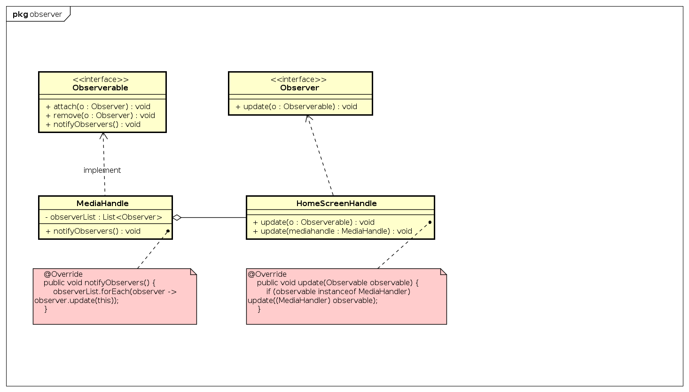

## Design pattern: Observer
### 1. MediaHandler

Ta có lớp `MediaHandle` implement interface `Observable` và lớp `HomScreenHandle` implement interface `Observer`

Lớp `MediaHandle` có một attribute là `listObserver`.

Khi lớp `HomScreenHandle`  được tạo, sẽ có 1 phương thức để gắn vào `listObserver`

Khi `MediaHandle` có sự thay đổi , hàm  `notifyObservers` sẽ gọi phương thức `update` trong `HomScreenHandle`

công việc (deadline tối T7)
- bổ sung tìm hiểu về Observable của javafx
- bổ sung Ob của những chỗ khác (JavaFx, code smell khác)